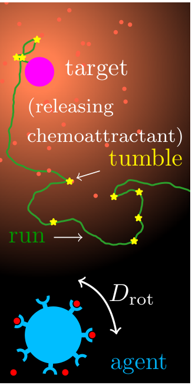
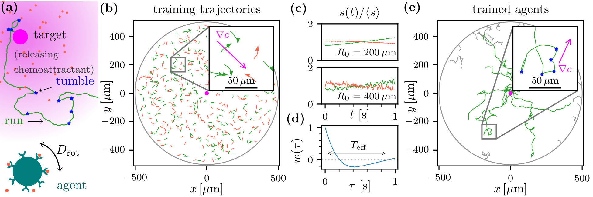
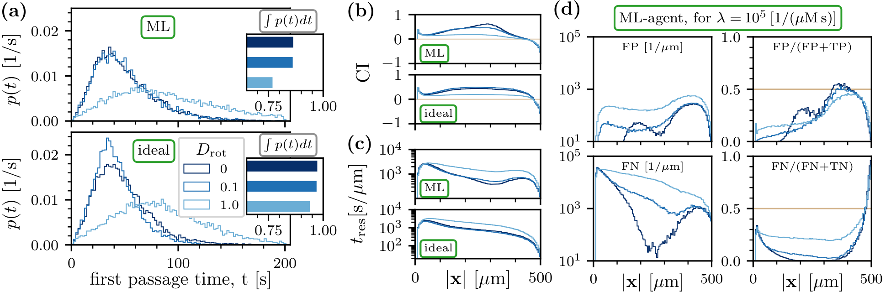
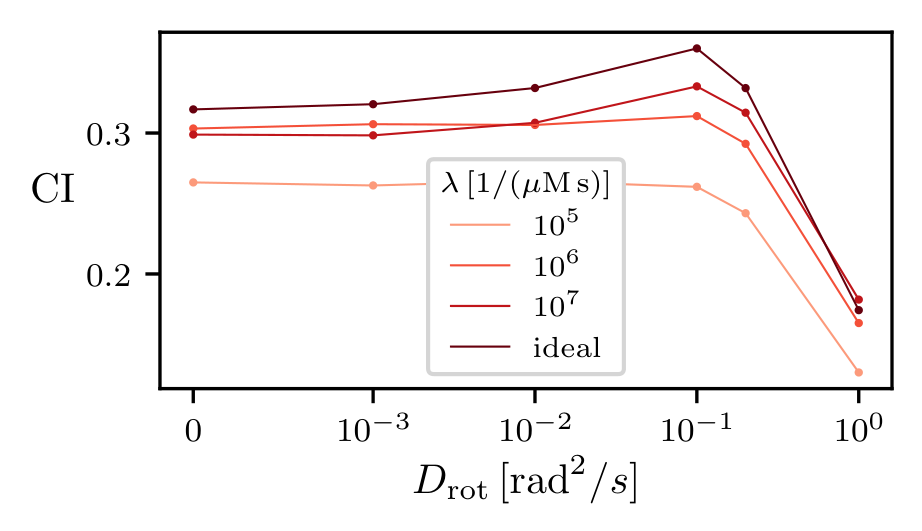

## Run-&-Tumble chemotaxis: agent based simulation
What to expect in this project:
- The run-and-tumble motion has been implemented using support vector machine (SVM).
- Large-scale agent based simulations for a wide range of parameters.
- Comparison of various performance measures such as first passsage times, Chemotactic Index (CI), etc.
- Necessary data to reproduce figure 1, 2 and 4 of the manuscript/article -- "Learning run-and-tumble chemotaxis" [Rahul O. Ramakrishnan and Benjamin M. Friedrich](https://link_to_arXiv)
- Source code in Python to reproduce the data

## Motivation
In run-&-tumble chemotaxis, the bacteria (agent) move in a straight line (the "run" phase) and record the binding events of chemoattractant molecules. If they move up the gradient, they prefer to continue in their current direction, but if they move down the gradient, they will randomly change direction (the "tumble" phase) and move in a new direction. This movement allows the bacteria to efficiently explore their environment and locate sources of food.
<p align="center">
  
</p>
<p align="center">
run-&-tumble chemotaxis
</p>

There are two physical constraints that make chemotaxis more challenging:
- motility noise, which results from rotational diffusion causing the agents (bacteria) to not move in a straight line, and
- sensing noise, which occurs when the binding events that make up the signal are stochastic.

The run-and-tumble mechanism is interesting because of its simplicity, and it is worth exploring whether machine-learning techniques can be used to model it and how well they approximate the benchmark measure.

## Key result

We modelled run-&-tumble chemotaxis using a machine learning (ML) agent that has been trained with short trajectories uniformly spread all over the simulation plane.
The trained agents are then allowed to search for food (hidden target) for an extended period of time by continuously monitoring the signal (binding events) and
thereby making subsequent decisions. Our trained ML-agents perform almost as well as ideal agents (those with prior knowledge about the concentration gradient).

Surprisingly, we found that chemotactic performance was slightly better with a low amount of motility noise compared to that of zero motility noise.

## Usage
To reproduce the figures, run the Python script as
```
python document.py
```
which will generate `figure1.eps`, `figure2.eps` and `figure4.eps` in the working directory and some additional figures inside the directory `fig`. Necessary data has already been provided in the directory `data`

To reproduce the entire data (this will take several hours or even days), one may start afresh by cleaning the directory `data` and run a couple of Python scripts as follows:
```
python main.py          # obtain the weight by training, and compute the score via testing.
python main_ideal.py    # agent based simulation of ideal agents. Can be run independently as the ideal agents do not use weights.
python main_lambda0.py  # agent based simulation of ML agents. Uses a particular parameter value.
python main_lambda1.py  # agent based simulation of ML agents. Uses a different parameter value.
python main_lambda2.py  # agent based simulation of ML agents. Uses yet another parameter value.
python load_data.py     # data required for certain figures has to be decompressed once.
python document.py      # produce all the necessary figures.
```

If necessary, modify the parameters specified in
```
inputs.py
```
before running the script `main.py`. The current set-up deals with 3 cases of ML-agents and 1 case of ideal agent. If more paramter combinations are required, then create different script files in a consistent manner.  

## Outcome
If run correctly, the expected figure would be:

<p align="center">
  
</p>
<p align="center">
Figure 1. A sequence: training trajectories --> singals and class labels --> optimal weights of the SVM ---> agent based simulation.
</p>

<p align="center">
  
</p>
<p align="center">
Figure 2. ML-agent vs ideal-agent. Various quality measures.
</p>

<p align="center">
  
</p>
<p align="center">
Figure 4. Chemotactic Index as a function of $D_{\mathrm{rot}}$, for a range of signal strength. CI is better with small $D_{\mathrm{rot}}$.
</p>

[Additional information](additional_info.md)
